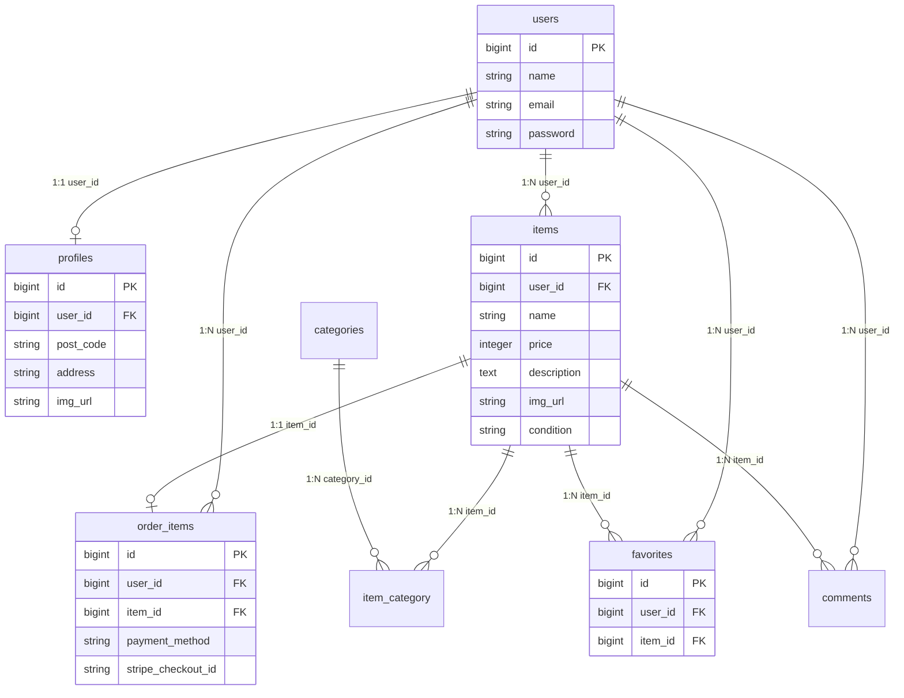

# 商品出品・購入プラットフォーム「COACHTECH フリマ」

Figmaのデザイン案に基づき、ユーザー間で商品を売買できるフリーマーケット形式のWebアプリケーションです。

## 1. アプリケーション概要

誰でも簡単に商品の出品、詳細確認、お気に入り登録、そして購入ができるプラットフォームです。

## 2. 実装済み機能一覧

* **認証機能**: 会員登録、ログイン、メール認証、ログアウト。
* **商品管理**: 商品一覧表示、検索、詳細表示。
* **出品・購入**: 商品出品、購入、SOLD表示。
* **決済機能**: **Stripeを使用したクレジットカード決済・コンビニ払い対応。**
* **マイページ**: プロフィール編集、出品・購入履歴一覧。

## 3. 使用技術

* **Language**: PHP 8.2.x
* **Framework**: Laravel 10.x / 11.x
* **Database**: MySQL 8.x
* **Infrastructure**: Docker / Docker Compose
* **Payment**: **Stripe API**

## 4. データベース設計（ER図）



## 5. 主要テーブル構成（カラム詳細）

| テーブル名 | 役割 | 主要カラム |
| :--- | :--- | :--- |
| users | ユーザー認証 | id, name, email, password |
| profiles | 住所情報 | user_id, post_code, address, img_url |
| items | 商品データ | user_id, name, price, condition, description |
| favorites | お気に入り | user_id, item_id |
| order_items | 決済・注文履歴 | user_id, item_id, payment_method, stripe_checkout_id |
| comments | コメント | user_id, item_id, content |
| categories | カテゴリー | id, name |

## 6. Stripeの決済フロー

1. ユーザーが購入画面で支払い方法を選択します。
2. アプリケーションが Stripe Checkout セッションを生成します。
3. ユーザーは Stripe の決済画面でクレジットカードまたはコンビニ払いを選択して支払いを完了します。
4. 決済完了後、注文情報を `order_items` テーブルに保存し、`stripe_checkout_id` をあわせて記録します。
5. 購入済みの商品は一覧画面上で SOLD として表示されます。

※テスト環境では、コンビニ支払いを選択した場合にその先の決済完了まで進めないことがあります。動作確認はクレジットカード決済を中心に行ってください。

## 7. バリデーション仕様

* 郵便番号: 入力必須、ハイフンありの8文字。
* 商品価格: 数値型、0円以上。
* 商品説明: 最大255文字。
* 画像形式: jpeg, png, jpg, 2MB以内。

## 8. 環境構築手順（Docker）

```bash
cp .env.example .env
docker-compose up -d --build
docker-compose exec app composer install
docker-compose exec app php artisan key:generate
docker-compose exec app php artisan migrate:fresh --seed
docker-compose exec app php artisan storage:link
```

※Stripe連携には `.env` に `STRIPE_PUBLIC_KEY` と `STRIPE_SECRET_KEY` の設定が必要です。

## 9. URL・ログイン情報

トップページ: http://localhost:8080/

ログインURL: http://localhost:8080/login
